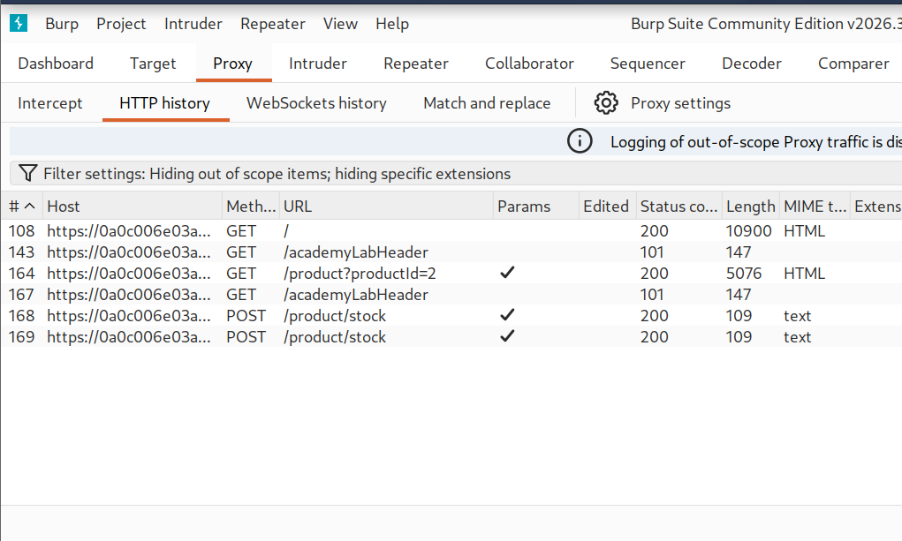
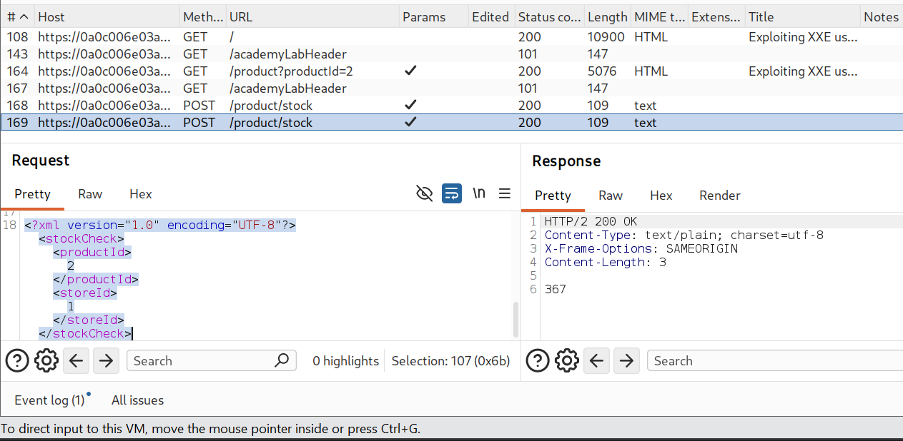
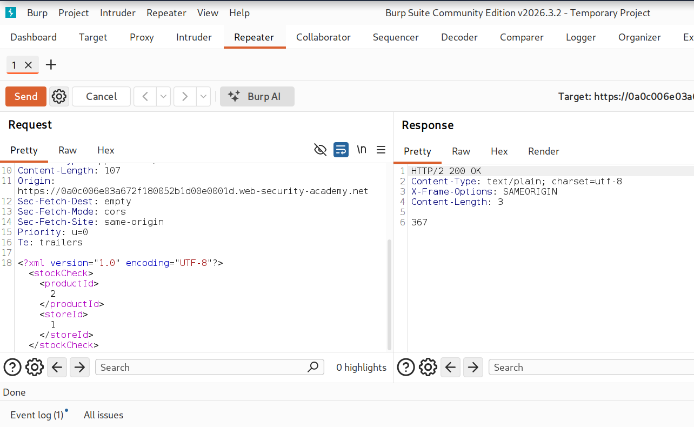
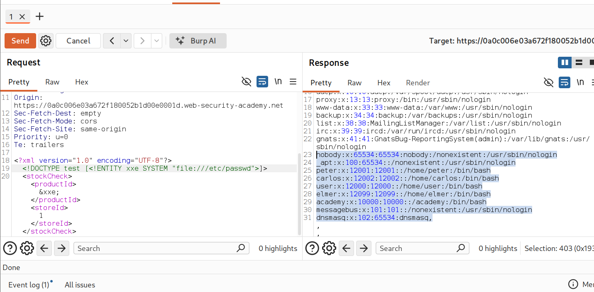

# PortSwigger Lab : XXE Injection Lab Write-up

## Overview

**Vulnerability Type:** XXE Exploitation
**Lab Link:** (https://portswigger.net/web-security/xxe/lab-exploiting-xxe-to-retrieve-files)  
**Date:** 2026-07-18  
**Difficulty:** Easy

## Description

XXE (XML External Entity Injection) is a vulnerability that occurs when XML parsers process external entities defined in the DOCTYPE declaration. Even if the application does not use these features, the underlying XML parser may still support them, creating an attack surface.

## Lab Objective

Retrieve the /etc/passwd file from the target server using XXE injection.

## Screenshots

### Lab Environment Setup


*Figure 1: Burp Suite showing the initial POST request to /product/stock and the response with stock quantity 367*

### Identifying XML Endpoint


*Figure 2: The application accepts XML input with productId and storeId elements*

### XXE Payload and Exploitation


*Figure 3: Injecting the XXE payload to read /etc/passwd*

### Successful File Disclosure


*Figure 4: Successful retrieval of /etc/passwd showing system user accounts*

## Attack Methodology

### Reconnaissance Phase

| Step | Action | Details |
|------|--------|---------|
| 1 | Identify XML Input Vectors | Look for endpoints accepting XML content-type, check POST requests with XML bodies |
| 2 | Determine XML Structure | Observe application's expected XML format, identify injection points |

### Exploitation Phase

| Step | Action | Payload/Command |
|------|--------|-----------------|
| 1 | Confirm XXE Vulnerability | `<!DOCTYPE test [<!ENTITY xxe SYSTEM "file:///etc/passwd">]>` |
| 2 | Validate Exploitation | Check if response contains file contents |
| 3 | Extract Information | Enumerate users: www-data, peter, carlos, user, elmer, academy |

## Core Concepts

### XML Entity Types

| Type | Syntax | Description |
|------|--------|-------------|
| Internal Entity | `<!ENTITY name "value">` | Defined and used within the same XML document |
| External Entity | `<!ENTITY name SYSTEM "URI">` | Reference external resources using URIs |
| DOCTYPE Declaration | `<!DOCTYPE root [<!ENTITY name SYSTEM "file:///path">]>` | Defines document type and entity declarations |

## Attack Types

| Attack Type | Purpose | Example Payload |
|-------------|---------|-----------------|
| File Disclosure | Read local files | `<!ENTITY xxe SYSTEM "file:///etc/passwd">` |
| SSRF | Make server request internal resources | `<!ENTITY xxe SYSTEM "http://169.254.169.254/latest/meta-data/">` |
| Blind XXE | OOB exfiltration when no response | Host DTD file, use `%eval;%exfil;` |
| Error-Based XXE | Force errors to leak info | `<!ENTITY % xxe SYSTEM "file:///nonexistent">` |

### File Disclosure Targets

| OS | Target Files |
|----|--------------|
| Linux | /etc/passwd, /etc/shadow, /etc/hosts, /proc/self/environ, /var/www/html/config.php |
| Windows | C:\windows\win.ini, C:\windows\system32\drivers\etc\hosts, C:\inetpub\wwwroot\web.config |

## Methodology Mindset

| Phase | Action Items |
|-------|--------------|
| 1. Identify Entry Points | Check Content-Type headers (application/xml, text/xml, application/soap+xml) |
| 2. Analyze XML Structure | Map elements, identify processed/returned fields, check validation |
| 3. Test Entity Injection | Define entity, reference in XML element, observe response |
| 4. Leverage Protocols | Use file://, http://, https://, ftp://, php:// |
| 5. Enumerate System | Read /etc/passwd, /etc/hosts, config files, service info |
| 6. Escalate Privileges | Find credentials, SSH keys, sensitive logs |
| 7. Bypass Techniques | Try different protocols, encoding, parameter entities |

## Common Defenses and Bypasses

| Defense | Bypass Technique |
|---------|------------------|
| Disable External Entities | Use alternative XML parsers, PHP wrappers |
| Input Validation | CDATA sections, encoding |
| Whitelist Allowed Entities | Parameter entities with DTD references |

## Tools and Resources

| Tool | Purpose |
|------|---------|
| Burp Suite Repeater | Test payloads |
| Burp Suite Intruder | Fuzzing |
| Burp Suite Collaborator | Detect blind XXE, OOB exfiltration |
| PayloadsAllTheThings | XXE wordlist |
| HackTricks | XML injection references |

## Lab Progression Structure

| Step | Milestone | Status |
|------|-----------|--------|
| 1 | Identify XML endpoint | Complete |
| 2 | Test basic XXE | Complete |
| 3 | Read /etc/passwd | Complete |
| 4 | Enumerate users | Complete |
| 5 | Find sensitive files | Pending |
| 6 | Escalate to RCE (if possible) | Pending |
| 7 | Document findings | Complete |

## Extracted User Information

```bash
www-data:x:33:33:www-data:/var/www:/usr/sbin/nologin
backup:x:34:34:backup:/var/backups:/usr/sbin/nologin
peter:x:12001:12001:/home/peter:/bin/bash
carlos:x:12002:12002:/home/carlos:/bin/bash
user:x:12000:12000:/home/user:/bin/bash
elmer:x:12099:12099:/home/elmer:/bin/bash
academy:x:10000:10000:/academy:/bin/bash
```
---
## Key Takeaways

XML parsers process external entities by default
Even unused features can be exploited
The DOCTYPE declaration is the injection point
File disclosure is often the first step
Different systems require different file paths
Blind XXE requires different techniques (OOB, error-based, time-based)
Always test multiple payload variations
Information disclosure leads to privilege escalation

---

**Author:** Water | **Date:** 2026-07-18 | **GitHub:** [@ohxf9a](https://github.com/ohxf9a)
---
