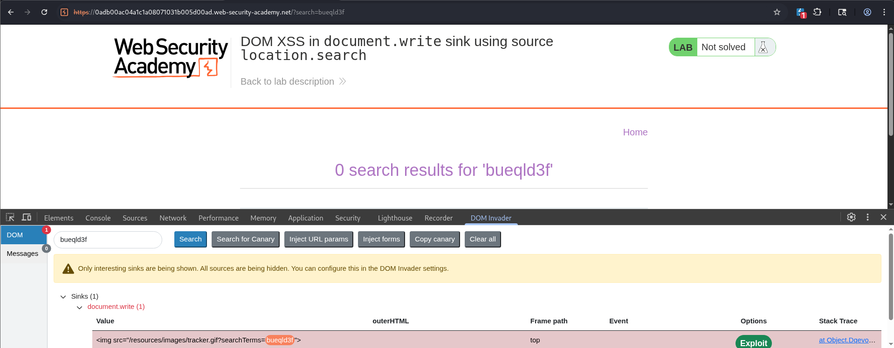

# PortSwigger Lab: DOM XSS in document.write sink using source location.search

## Overview

- **Vulnerability Type:** DOM-Based Cross-Site Scripting (XSS)
- **Lab Link:** [DOM XSS in `document.write` sink using source `location.search`](https://portswigger.net/web-security/cross-site-scripting/dom-based/lab-document-write-sink)
- **Date:** 2026-07-27
- **Difficulty:** Apprentice

## Description

This lab contains a DOM-based XSS vulnerability in the search functionality. The application uses `document.write` to insert user-controlled data from the `location.search` source directly into the page. The solution involves using Burp Suite's DOM Invader to identify the sink and automatically generate an exploit.

## Lab Objective

Execute an arbitrary JavaScript payload in the victim's browser by exploiting a DOM-based XSS vulnerability where the `search` query parameter is written directly to the page using `document.write`.

## Screenshots & Figures



*Figure 1: DOM Invader identifying the `document.write` sink and the reflected payload.*

![Figure 2: DOM Invader stack trace showing trackSearch function and document.write call]
(images/DOM-Invader-stack-trace.png)

*Figure 2: DOM Invader's stack trace showing the `trackSearch` function and the `document.write` call.*

![Figure 3: Vulnerable JavaScript code responsible for the XSS]
(images/vulnerable-javascript-code.png)

*Figure 3: The vulnerable JavaScript code responsible for the XSS.*

![Figure 4: Congratulations message confirming the lab was solved]
(images/lab-solved-confirmation.png)

*Figure 4: Congratulations message confirming the lab was solved.*

## Attack Methodology

### Reconnaissance Phase

| Step | Action | Details |
|------|--------|---------|
| 1 | Identify Reflection Point | The `search` GET parameter is reflected in the page's HTML. |
| 2 | Test Basic Payloads | Simple payloads like `<script>alert()</script>` are reflected but not executed. |
| 3 | Analyze DOM Behavior | The reflection occurs via `document.write` in JavaScript, not server-side. |

### DOM Invader Analysis

- **Enable DOM Invader:** In Burp Suite's built-in browser, enable DOM Invader.
- **Perform Search:** Enter any search term (e.g., `test`).
- **Identify Sink:** DOM Invader detects the `document.write` sink and shows the payload being written.
- **Analyze Stack Trace:** DOM Invader provides a stack trace showing the exact JavaScript function (`trackSearch`) and line number responsible for the vulnerability.
- **Review Source Code:** The vulnerable code is revealed:
```javascript
function trackSearch(query) {
    document.write('<script>alert()</script>` |
| Exploit Generation | Automatically craft working XSS payload | DOM Invader's "Exploit" function |

## Methodology Mindset

```
[1. Identify DOM Source]
       │
       ▼
[2. Trace Data Flow] ──────> Use DOM Invader to map source to sink
       │
       ▼
[3. Inject Canary] ───────> Paste canary to verify reflection
       │
       ▼
[4. Confirm Sink] ────────> DOM Invader detects document.write
       │
       ▼
[5. Generate Payload] ────> Use DOM Invader's "Exploit" button
       │
       ▼
[6. Verify Execution] ────> Lab solved confirmation
```

1. **Identify DOM Source:** Recognize that `location.search` is a source of user input.
2. **Trace Data Flow:** Use DOM Invader to track the flow from source to sink.
3. **Inject Canary:** Paste the DOM Invader canary to confirm reflection.
4. **Confirm Sink:** Verify that `document.write` is used unsafely.
5. **Generate Payload:** Let DOM Invader automatically create the exploit.
6. **Verify Execution:** Confirm successful JavaScript execution.

## Common Defenses and Bypasses

| Defense | Bypass Technique |
|---------|------------------|
| `document.write` with unsanitized input | Inject HTML tags and attributes to break out of context |
| Context-aware encoding | Not implemented in this lab |
| Input validation | DOM Invader's canary bypasses basic filtering |

## Tools and Resources

- **Burp Suite DOM Invader:** Automatically detect and exploit DOM-based XSS.
- **Burp Suite Browser:** Built-in Chromium browser with DOM Invader integration.
- **Canary:** DOM Invader's test string to identify reflection points.
- **Exploit Button:** One-click exploit generation in DOM Invader.

## Lab Progression Structure

1. **Step 1:** Enable DOM Invader in Burp's browser.
2. **Step 2:** Perform a search to trigger the vulnerable code.
3. **Step 3:** Copy the DOM Invader canary.
4. **Step 4:** Paste the canary into the search bar.
5. **Step 5:** Identify the `document.write` sink in DOM Invader.
6. **Step 6:** Click the "Exploit" button to solve the lab.

## Key Takeaways

- **DOM XSS is client-side:** The vulnerability exists entirely in the browser's DOM manipulation, not server-side reflection.
- **document.write is dangerous:** Writing user-controlled data with `document.write` can lead to XSS.
- **DOM Invader simplifies discovery:** It automatically maps sources to sinks and generates exploits.
- **Context matters:** Breaking out of an HTML attribute requires understanding the surrounding code.
- **Automated tools speed up exploitation:** DOM Invader's "Exploit" button eliminates manual payload crafting.

---

**Author:** Water | **Date:** 2026-07-27 | **GitHub:** @ohxf9a
