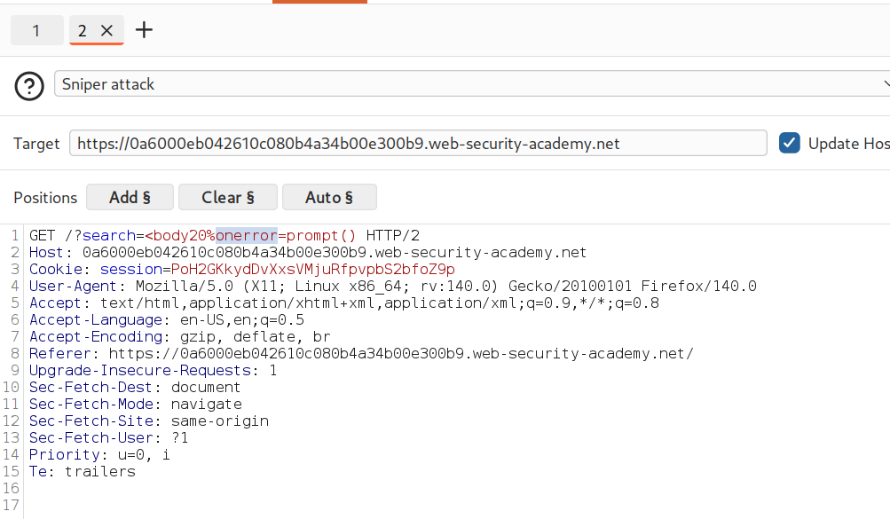
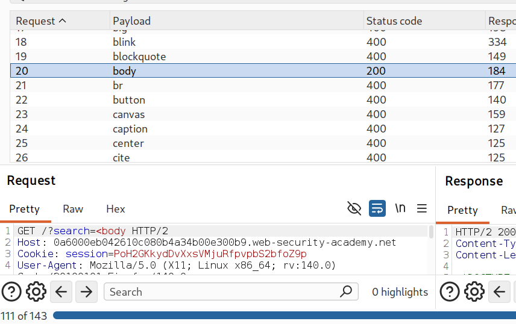
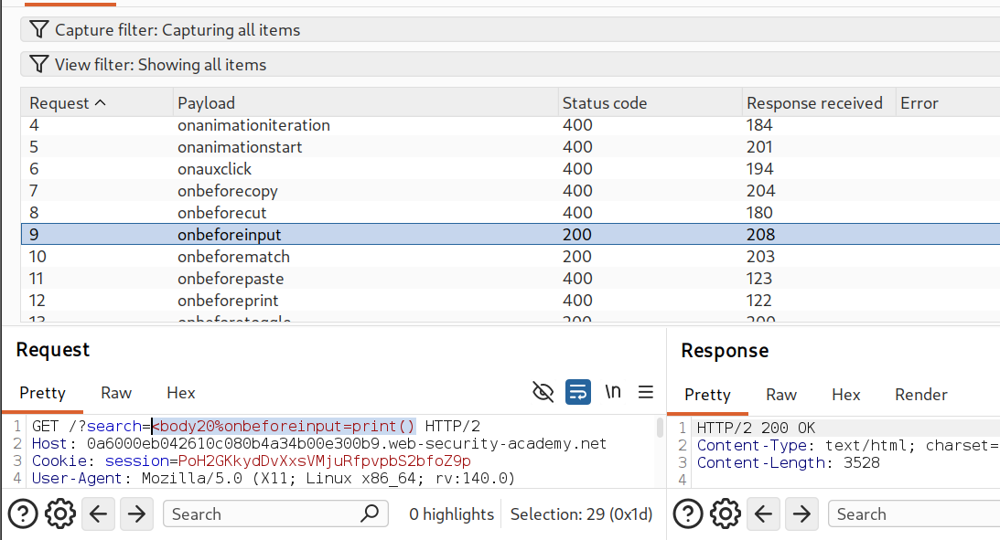
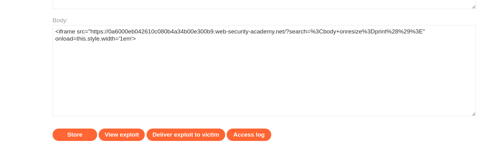
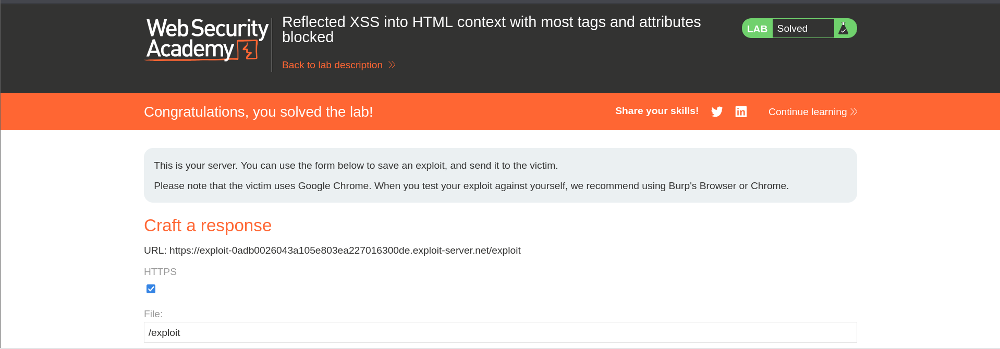

# PortSwigger Lab: Reflected XSS with Tag/Attribute Filter Bypass

## Overview
* **Vulnerability Type:** Reflected Cross-Site Scripting (XSS)
* **Lab Link:** [Reflected XSS into HTML context with most tags and attributes blocked](https://portswigger.net/web-security/cross-site-scripting/contexts/lab-html-context-with-most-tags-and-attributes-blocked)
* **Date:** 2026-07-25
* **Difficulty:** Medium

---

## Description
This lab contains a reflected XSS vulnerability in the search functionality. The application blocks almost all HTML tags and attributes, making it challenging to find a working XSS payload. The solution involves identifying allowed tags and event handlers, then creating an exploit chain to trigger JavaScript execution.

## Lab Objective
Execute the `print()` function in the victim's browser by exploiting a reflected XSS vulnerability with strict filtering in place.

---

## Screenshots & Figures


*Figure 1: Burp Suite showing the initial GET request to `/?search=` with the response status code.*


*Figure 2: Burp Intruder results showing allowed tags (200 OK) vs blocked tags (400 Bad Request).*


*Figure 3: Testing various event handlers with the `<body>` tag in Burp Repeater.*


*Figure 4: The exploit server payload using an `<iframe>` to trigger the XSS.*


*Figure 5: Congratulations message confirming the lab was solved.*

---

## Attack Methodology

### Reconnaissance Phase
| Step | Action | Details |
| :--- | :--- | :--- |
| **1** | Identify Reflection Point | The search GET parameter is reflected in the response HTML. |
| **2** | Test Basic Payloads | Simple payloads like `<script>alert()</script>` are blocked. |
| **3** | Determine Filter Behavior | Server returns status `400` for blocked tags, `200` for allowed ones. |

### Tag Discovery Process
1. **Use XSS Cheat Sheet:** Load PortSwigger's XSS cheat sheet for a comprehensive tag list.
2. **Send to Intruder:** Configure Burp Intruder with the tag list as payloads.
3. **Analyze Results:** Filter responses by HTTP status code to identify allowed tags.
4. **Identify Allowed Tag:** `<body>` returns `200 OK` while most others return `400 Bad Request`.

### Attribute / Event Handler Testing
| Step | Action | Result |
| :--- | :--- | :--- |
| **1** | Test `onbeforeprint` | Requires user interaction (print dialog) — unreliable. |
| **2** | Test `onbeforeinput` | Requires user input — not suitable for automatic trigger. |
| **3** | Test `onresize` | Can be triggered programmatically — **SUCCESS**. |

### Exploitation Phase
1. **Craft XSS Payload:** `<body onresize=print()>`
2. **URL Encode:** `%3Cbody+onresize%3Dprint%28%29%3E`
3. **Create Exploit Page:** Use an `<iframe>` to load the vulnerable page with payload.
4. **Trigger Event:** Use `iframe` `onload` to resize and trigger `onresize`.

---

## Core Concepts

### HTML Event Handlers Tested
| Event Handler | Trigger | Result |
| :--- | :--- | :--- |
| `onbeforeprint` | User opens print dialog | Requires interaction |
| `onbeforeinput` | User inputs text | Requires interaction |
| `onresize` | Element resizes | **Programmatically triggerable** |

### Why This Attack Works
* **Filter Bypass:** The server's blacklist does not include `<body>` or `onresize`.
* **Event Triggering:** The `iframe`'s `onload` event changes its width, triggering the `onresize` event on the embedded page.
* **Browser Behavior:** Chrome allows `onresize` events to be triggered programmatically.

---

## Exploit Chain

| Component | Purpose |
| :--- | :--- |
| **Vulnerable Page** | Reflects search parameter into HTML |
| **XSS Payload** | Injects `<body onresize=print()>` into reflected content |
| **Iframe** | Loads the vulnerable page with the injected payload |
| **`onload` Event** | Triggers `iframe` resize, which triggers the `onresize` event |
| **`print()` Function** | Executes JavaScript, confirming XSS execution |

---

## Attack Types
| Attack Type | Purpose | Example Payload |
| :--- | :--- | :--- |
| **Tag Discovery** | Find allowed tags | `<body>` returns `200` |
| **Event Handler Discovery** | Find triggerable events | `onresize` works |
| **Direct XSS** | Execute code via reflected input | `<body onresize=print()>` |
| **Iframe-based Trigger** | Programmatically trigger event | `<iframe onload=this.style.width="1em">` |

---

## Why `onresize` Worked vs Other Events
| Event | Why It Failed / Succeeded |
| :--- | :--- |
| `onbeforeprint` | Requires user to actually print the page |
| `onauxclick` | Requires middle mouse button click |
| `onbeforeinput` | Requires actual user input |
| `onresize` | **SUCCESS** — Can be triggered programmatically via iframe resize |

---

## Methodology Mindset

```
[1. Identify Reflection]
       │
       ▼
[2. Test Filtering] ──────> Use Burp Intruder & XSS Cheat Sheet
       │
       ▼
[3. Find Event Handlers] ──> Test allowed tags (e.g., <body>)
       │
       ▼
[4. Understand Triggers] ─> Check if triggerable programmatically
       │
       ▼
[5. Craft Exploit] ───────> Build iframe chain
       │
       ▼
[6. Deliver Payload] ──────> Send via Exploit Server
       │
       ▼
[7. Verify Execution] ────> Confirm JavaScript execution (print dialog)
```

1. **Identify Reflection:** Check all user-controlled input that appears in response.
2. **Test Filtering:** Use Burp Intruder with XSS cheat sheet to find allowed tags.
3. **Find Event Handlers:** Test various event handlers on allowed tags.
4. **Understand Triggers:** Determine if event handler can be triggered programmatically.
5. **Craft Exploit:** Build exploit chain to automatically trigger the XSS.
6. **Deliver Payload:** Use exploit server to send to victim.
7. **Verify Execution:** Confirm JavaScript executed (`print()` dialog).

---

## Common Defenses and Bypasses

| Defense | Bypass Technique |
| :--- | :--- |
| **Tag Blacklist** | Test all tags to find allowed ones |
| **Attribute Blacklist** | Test all event handlers |
| **String Filters** | Use different event handlers |
| **Content Security Policy (CSP)** | Not implemented in this lab |

---

## Tools and Resources

* **Burp Suite Repeater:** Test individual payloads.
* **Burp Suite Intruder:** Fuzz for allowed tags and attributes.
* **PortSwigger XSS Cheat Sheet:** Comprehensive list of tags/attributes to test.
* **Burp Suite Browser:** Test exploits in Chrome environment.
* **Exploit Server:** Host and deliver payloads to victims.

---

## Lab Progression Structure

- [x] Step 1: Identify reflection point
- [x] Step 2: Determine allowed tags
- [x] Step 3: Find working event handler
- [x] Step 4: Craft XSS payload
- [x] Step 5: Build exploit chain
- [x] Step 6: Deliver to victim
- [x] Step 7: Confirm execution

---

## Final Exploit Payload

```html
<iframe src="https://0a6000eb042610c080b4a34b00e300b9.web-security-academy.net/?search=%3Cbody+onresize%3Dprint%28%29%3E" onload=this.style.width="1em"></iframe>
```

### Payload Breakdown

| Component | Purpose |
| :--- | :--- |
| `<iframe ...>` | Container to load the vulnerable page |
| `src=".../?search=%3Cbody+onresize%3Dprint%28%29%3E"` | Loads vulnerable page with URL-encoded XSS payload |
| `onload=this.style.width="1em"` | Triggers dynamic resize of iframe, activating `onresize` |

---

## Key Takeaways

1. **Blacklisting is ineffective:** Blocking common tags/attributes isn't enough; proper context-aware output encoding is essential.
2. **Test all tags and attributes:** You might find unexpected vectors like `<body>` with `onresize`.
3. **Consider triggering mechanisms:** Some event handlers require specific interactions; find ones you can trigger programmatically.
4. **Browser differences matter:** The victim uses Chrome; some events work differently across browsers.
5. **Iframes are powerful exploitation tools:** They can be used to trigger window/element events on embedded pages.
6. **Event handlers can be triggered by CSS/JS:** Even simple operations like dynamic resizing can trigger JavaScript execution.

---

**Author:** Water | **Date:** 2026-07-25 | **GitHub:** [@ohxf9a](https://github.com/ohxf9a)
