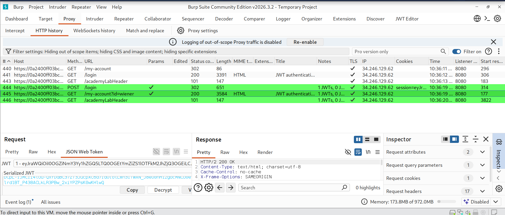
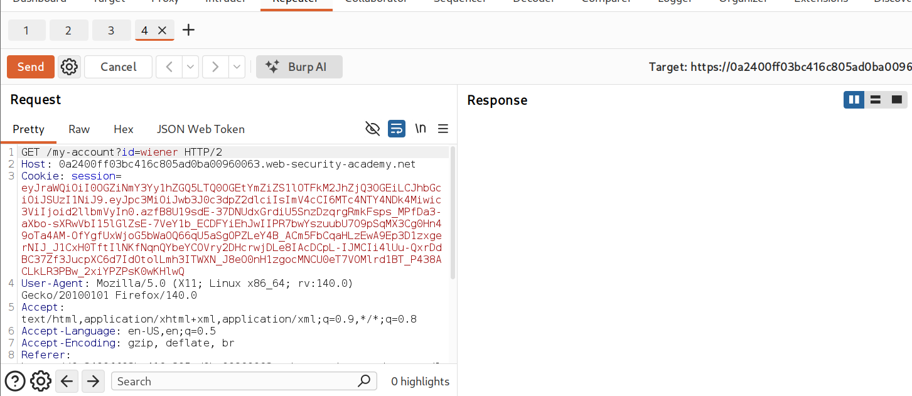
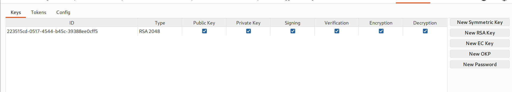
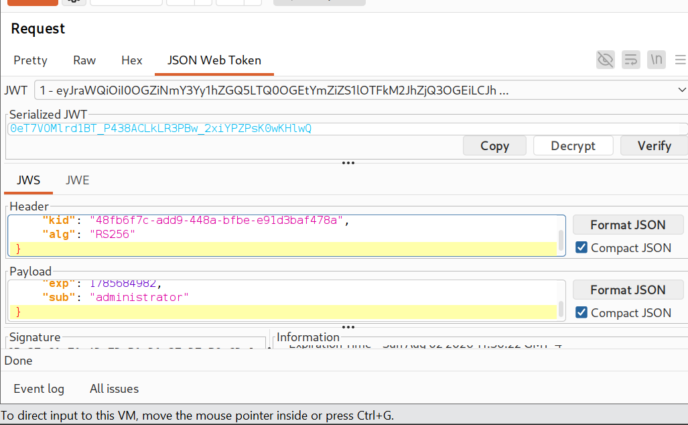
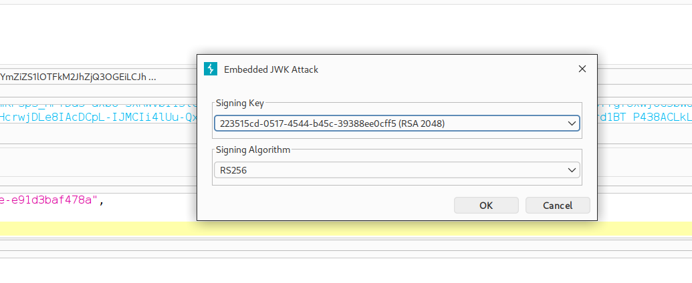
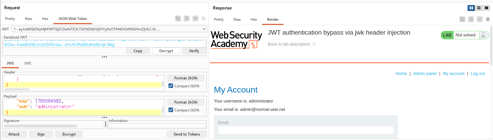
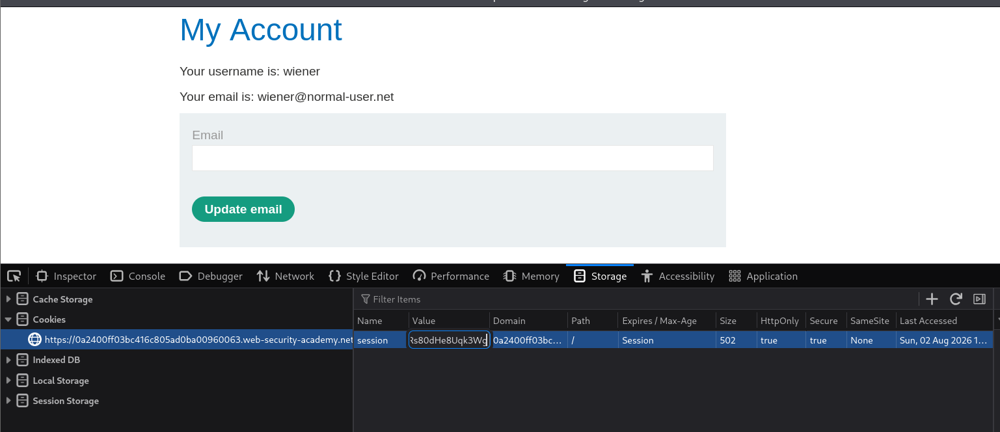
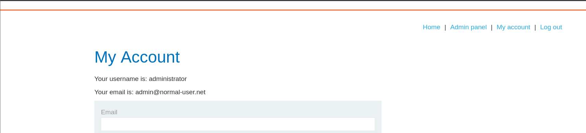
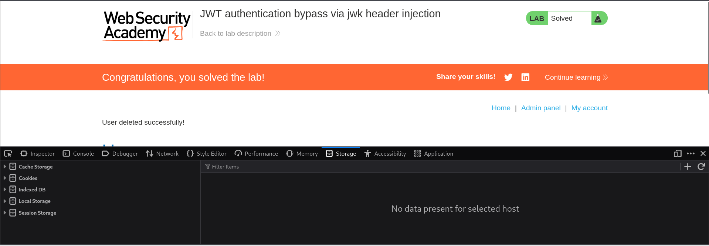

# PortSwigger Lab: JWT Authentication Bypass via JWK Header Injection

## Overview

- **Vulnerability Type**: JWT (JSON Web Token) Authentication Bypass
- **Lab Link**: JWT authentication bypass via jwk header injection
- **Date**: 2026-08-02
- **Difficulty**: Practitioner

## Description

This lab demonstrates a critical vulnerability where the server accepts and trusts the `jwk` (JSON Web Key) parameter in the JWT header. This oversight allows attackers to inject their own public key, forge a token with that key, and have the server accept it as valid, effectively granting themselves administrative privileges without knowing the server's private key.

## Lab Objective

Gain access to the administrator panel and delete the user `carlos` by exploiting the JWK header injection vulnerability.

## Screenshots & Figures



Figure 1: Burp Suite Proxy history showing intercepted traffic with JWT tokens highlighted in green
  


Figure 2: Initial GET request to /my-account containing the original JWT token in the session cookie



Figure 3: JWT Editor Keys tab displaying the newly generated RSA key pair with its unique ID



Figure 4: JWT Editor showing the decoded token with the sub claim modified from "wiener" to "administrator"
  


Figure 5: Embedded JWK Attack dialog in the JWT Editor, selecting the generated RSA key for signing



Figure 6: Successful request showing the administrator account page after sending the forged JWT



Figure 7: Original account page for user wiener with the session cookie before the attack



Figure 8: Administrator account page after successfully forging the token with the injected JWK

Figure 9: Lab success message confirming the deletion of user carlos and completion of the challenge



## Attack Methodology

### Reconnaissance Phase

| Step | Action | Details |
|------|--------|---------|
| 1 | **Initial Login** | Logged in to the application using the provided credentials (`wiener:wiener`). |
| 2 | **Intercept Traffic** | Used Burp Suite to intercept the HTTP traffic and captured the session cookie. |
| 3 | **Identify JWT** | Observed that the session cookie contained a JWT token. The JWT Editor plugin highlighted JWT tokens in green. |

### JWT Analysis and Key Generation Phase

| Step | Action | Details |
|------|--------|---------|
| 1 | **Decode Token** | Used the JWT Editor plugin to decode the JWT token. |
| 2 | **Analyze Structure** | Identified the `kid`, `alg`, and `sub` parameters in the token's header and payload. |
| 3 | **Generate RSA Key** | Created a new RSA key pair using the JWT Editor's key generation feature. |
| 4 | **Copy Key ID** | Noted the generated key ID (`223515cd-0517-4544-b45c-39388ee0cff5`) for use in the attack. |

### Token Forgery Phase

| Step | Action | Details |
|------|--------|---------|
| 1 | **Modify Payload** | Changed the `sub` (subject) claim from `"wiener"` to `"administrator"` to escalate privileges. |
| 2 | **Launch Attack** | Used the JWT Editor's "Attack" feature and selected "Embedded JWK Attack". |
| 3 | **Select Signing Key** | Chose the newly generated RSA key (`223515cd-0517-4544-b45c-39388ee0cff5`) as the signing key. |
| 4 | **Sign Token** | The plugin automatically embedded the public key as a `jwk` parameter in the header and signed the token with the corresponding private key. |

### Exploitation Phase

| Step | Action | Details |
|------|--------|---------|
| 1 | **Send Request** | Sent the forged JWT in a request to the server. |
| 2 | **Verify Access** | Received a `200 OK` response with the administrator account page, confirming the server accepted the forged token. |
| 3 | **Replace Cookie** | Copied the serialized, forged JWT and replaced the existing session cookie in the browser. |
| 4 | **Access Admin Panel** | Removed the `id=wiener` parameter from the URL and navigated to the `/admin` panel. |
| 5 | **Delete User** | Used the admin panel to delete the user `carlos`, completing the lab objective. |

## Core Concepts

### JWT with JWK Header

A JWT with a `jwk` header parameter allows clients to provide a public key for signature verification:

```json
{
  "kid": "223515cd-0517-4544-b45c-39388ee0cff5",
  "alg": "RS256",
  "jwk": {
    "kty": "RSA",
    "e": "AQAB",
    "n": "...",
    "kid": "223515cd-0517-4544-b45c-39388ee0cff5"
  }
}
```

### Why This Attack Works

- **Vulnerability**: The server trusts the `jwk` parameter and uses the provided key for signature verification.
- **Key Injection**: By embedding our own public key, we control the verification process.
- **Signature Forgery**: We can sign the token with the matching private key, making it appear valid to the server.

### Attack Chain

1.  **Login**: Obtain a valid JWT token from the server.
2.  **Generate Key**: Create a new RSA key pair using the JWT Editor.
3.  **Forge Token**: Modify the `sub` claim to `administrator` and use the Embedded JWK Attack to sign it.
4.  **Inject JWK**: The attack automatically adds the public key as a `jwk` parameter in the header.
5.  **Sign**: The token is signed with the private key.
6.  **Send Request**: The forged token is sent to the server.
7.  **Server Verifies**: The server uses the provided `jwk` to verify the signature and accepts it as valid.
8.  **Access Granted**: The server processes the forged token, granting administrative privileges.

## JWT Attack Details

### Original JWT

| Component | Value |
|-----------|-------|
| **Header** | `{"kid": "48fb6f7c-add9-448a-bfbe-e91d3baf478a", "alg": "RS256"}` |
| **Payload** | `{"exp": 1785684982, "sub": "wiener"}` |

### Forged JWT with JWK Injection

| Component | Value |
|-----------|-------|
| **Header** | `{"kid": "223515cd-0517-4544-b45c-39388ee0cff5", "alg": "RS256", "jwk": {"kty": "RSA", "e": "AQAB", "n": "...", "kid": "223515cd-0517-4544-b45c-39388ee0cff5"}}` |
| **Payload** | `{"exp": 1785684982, "sub": "administrator"}` |
| **Signature** | Signed with the generated private key |

## Tools and Resources

- **Burp Suite Professional**: Used for intercepting, modifying, and replaying HTTP requests.
- **JWT Editor Plugin**: A Burp Suite extension that provides:
  - Decoding and editing JWT tokens
  - Key generation (RSA, EC, OKP, symmetric)
  - Attack automation (Embedded JWK Attack, Key Confusion Attack, etc.)
- **Web Browser**: Used to access the lab and test the forged JWT token.
- **Developer Tools**: Used to view and modify the session cookie stored in the browser's Application tab.

## Key Takeaways

- **Never Trust the `jwk` Parameter**: Servers should never accept or use embedded keys for signature verification without proper validation.
- **Use a Trusted Key Store**: Public keys should come from a trusted source, not from user input.
- **Disable Key Injection**: The server should reject tokens that contain a `jwk` parameter unless absolutely necessary and properly validated.
- **Validate the `kid`**: Ensure the `kid` matches a key in the server's trusted key store.
- **Implement Proper Key Management**: Securely store and manage the keys used for signing and verifying JWT tokens.
- **Use Strong Signing Algorithms**: Prefer secure algorithms and ensure keys are properly managed.

## Attack Mindset

```
[1. Intercept Traffic]
       │
       ▼
[2. Identify JWT Token]
       │
       ▼
[3. Generate RSA Key] ──────────> Use JWT Editor's key generation
       │
       ▼
[4. Modify Payload] ─────────────> Change 'sub' to 'administrator'
       │
       ▼
[5. Launch Embedded JWK Attack] ─> Select generated key
       │
       ▼
[6. Send Request] ──────────────> Verify admin access
       │
       ▼
[7. Replace Cookie] ────────────> Use forged token in browser
       │
       ▼
[8. Access Admin Panel] ────────> Remove 'id=wiener' from URL
       │
       ▼
[9. Delete Carlos] ─────────────> Complete lab objective
```

## Common Defenses and Bypasses

| Defense | Bypass Technique |
|---------|------------------|
| Accepting `jwk` parameter | Server uses provided key for verification |
| No key validation | Trusts any key provided in the header |
| No `kid` validation | Accepts any `kid` without cross-referencing |
| Trusting user-controlled data | Signature verification uses user-provided public key |

## Similar Attack Variants

| Attack Type | Description |
|-------------|-------------|
| **Embedded JWK Attack** | Injecting a public key in the JWT header |
| **Key Confusion Attack** | Confusing symmetric and asymmetric algorithms |
| **Algorithm Confusion** | Changing `alg` to `none` or `HS256` |
| **Kid Injection Attack** | Injecting a `kid` that points to an attacker-controlled key |

## Author

**Water** | Date: 2026-08-02 | GitHub: [@ohxf9a](https://github.com/ohxf9a)
