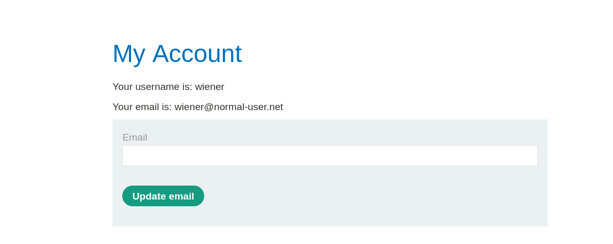
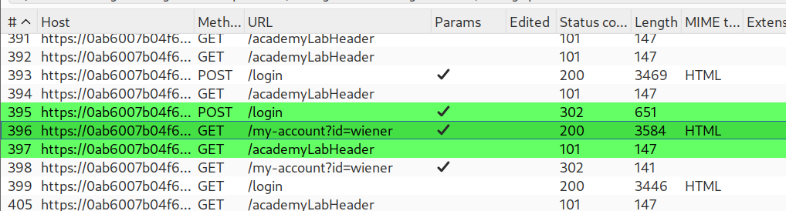
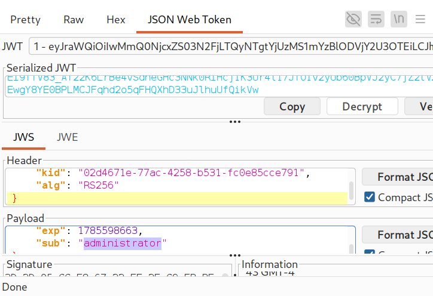
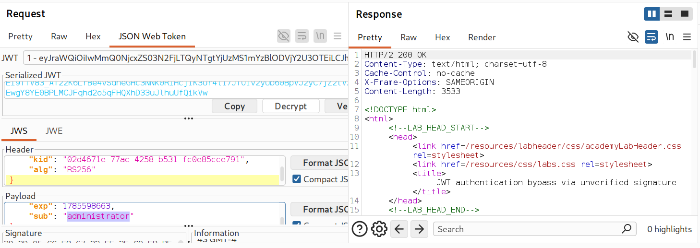
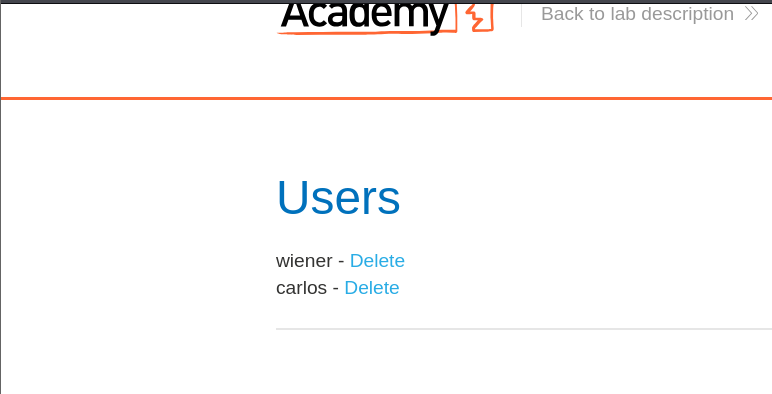
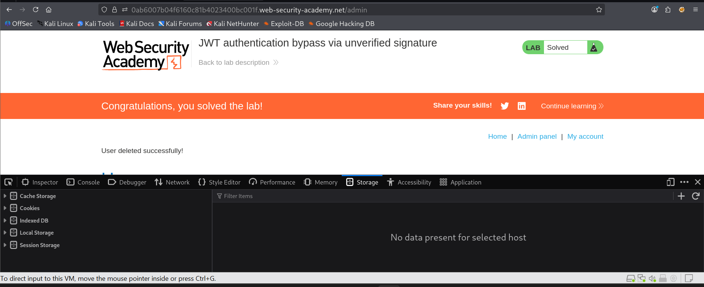

# PortSwigger Lab: JWT Authentication Bypass via Unverified Signature

## Overview

- **Vulnerability Type**: JWT (JSON Web Token) Authentication Bypass
- **Lab Link**: JWT authentication bypass via unverified signature
- **Date**: 2026-08-01
- **Difficulty**: Practitioner

## Description

This lab demonstrates a critical vulnerability where the server fails to verify the signature of JWT tokens. This oversight allows attackers to forge their own tokens by modifying the token's payload and algorithm header, effectively granting themselves administrative privileges without needing the correct signing key.

## Lab Objective

Gain access to the administrator panel and delete the user `carlos` by exploiting the JWT signature verification bypass.

## Screenshots & Figures

*Figure 1: The initial account page for the user `wiener` after logging in with provided credentials.*

*Figure 2: Burp Suite Proxy history showing the intercepted traffic, including the JWT token in the session cookie.*

*Figure 3: Burp Suite's JWT Editor plugin displaying the token's decoded header and payload, highlighting the `kid`, `alg`, and `sub` parameters.*

*Figure 4: The crafted JWT in the request sent to Repeater, with the subject changed to `administrator`.*

*Figure 5: The administrator account page, accessed after replacing the session cookie with the forged token and removing the `id=wiener` parameter from the URL.*

*Figure 6: The admin panel showing the list of users (`wiener` and `carlos`) with the option to delete them.*

*Figure 7: The lab's success message confirming the deletion of user `carlos` and the completion of the challenge.*

## Attack Methodology

### Reconnaissance Phase

| Step | Action | Details |
|------|--------|---------|
| 1 | **Initial Login** | Logged in to the application using the provided credentials (`wiener:wiener`). |
| 2 | **Intercept Traffic** | Used Burp Suite to intercept the HTTP traffic and captured the session cookie. |
| 3 | **Identify JWT** | Observed that the session cookie contained a JWT token. |

### JWT Analysis and Modification Phase

| Step | Action | Details |
|------|--------|---------|
| 1 | **Decode Token** | Used the JWT Editor plugin in Burp Suite to decode the JWT token. |
| 2 | **Analyze Structure** | Identified the `kid` (Key ID), `alg` (Algorithm), and `sub` (Subject) parameters in the token's header and payload. |
| 3 | **Modify Payload** | Changed the `sub` (subject) claim from `"wiener"` to `"administrator"` to escalate privileges. |
| 4 | **Change Algorithm** | Modified the `alg` header from `RS256` to `none` to bypass signature verification. |

### Exploitation Phase

| Step | Action | Details |
|------|--------|---------|
| 1 | **Send to Repeater** | Sent the modified JWT token in a request to Burp Repeater for testing. |
| 2 | **Verify Access** | Received a `200 OK` response, confirming the server accepted the forged token and granted access. |
| 3 | **Replace Cookie** | Copied the serialized, forged JWT and replaced the existing session cookie in the browser. |
| 4 | **Access Admin Panel** | Removed the `id=wiener` parameter from the URL and navigated to the `/admin` panel. |
| 5 | **Delete User** | Used the admin panel to delete the user `carlos`, completing the lab objective. |

## Core Concepts

### JWT Structure

A JWT is composed of three parts separated by dots:
1.  **Header**: Contains metadata about the token, such as the signing algorithm (`alg`) and key ID (`kid`).
2.  **Payload**: Contains the claims, including the subject (`sub`) which represents the user.
3.  **Signature**: Created by signing the header and payload with a secret key using the specified algorithm.

### Why This Attack Works

- **Vulnerability**: The server does not verify the signature of the JWT.
- **Algorithm Confusion**: By changing the algorithm to `none`, the server is tricked into accepting the token without validating a signature.
- **Privilege Escalation**: By modifying the `sub` claim, the attacker changes their identity to a higher-privileged user.

## JWT Attack Details

### Original JWT

| Component | Value |
|-----------|-------|
| **Header** | `{"kid": "02d4671e-77ac-4258-b531-fc0e85cce791", "alg": "RS256"}` |
| **Payload** | `{"exp": 1785598663, "sub": "wiener"}` |

### Forged JWT

| Component | Value |
|-----------|-------|
| **Header** | `{"kid": "02d4671e-77ac-4258-b531-fc0e85cce791", "alg": "none"}` |
| **Payload** | `{"exp": 1785598663, "sub": "administrator"}` |
| **Signature** | Empty (as the `none` algorithm requires no signature) |

### Exploit Chain

1.  **Login**: Obtain a valid JWT token from the server.
2.  **Decode**: Parse the JWT to understand its structure.
3.  **Forge**: Modify the `alg` header to `none` and the `sub` claim to `administrator`.
4.  **Encode**: Re-encode the new header and payload, leaving the signature part empty.
5.  **Replace**: Use the forged token as the session cookie in the browser.
6.  **Access**: Navigate to the admin panel, bypassing the ID parameter.
7.  **Execute**: Delete the target user.

## Tools and Resources

- **Burp Suite Professional**: Used for intercepting, modifying, and replaying HTTP requests.
- **JWT Editor Plugin**: A Burp Suite extension that simplifies decoding, editing, and re-encoding JWT tokens.
- **Web Browser**: Used to access the lab and test the forged JWT token.
- **Developer Tools**: Used to view and modify the session cookie stored in the browser's Application tab.

## Key Takeaways

- **Always Verify Signatures**: Servers must always validate the signature of incoming JWTs. Failure to do so allows attackers to forge tokens with arbitrary claims.
- **Disable the `none` Algorithm**: The `none` algorithm should be disabled in production environments, as it bypasses signature verification entirely.
- **Treat `kid` as Untrusted Input**: The `kid` parameter should not be used in a way that could lead to path traversal or injection attacks. It should be validated against a trusted list of keys.
- **Use Strong Signing Algorithms**: Prefer secure algorithms like `RS256` (RSASSA-PKCS1-v1_5 with SHA-256) or `ES256` (ECDSA with SHA-256) over `HS256` (HMAC with SHA-256) when possible, and ensure keys are properly managed.
- **Implement Proper Key Management**: Securely store and manage the keys used for signing and verifying JWT tokens.

## Author

**Water** | Date: 2026-08-01 | GitHub: [@ohxf9a](https://github.com/ohxf9a)
